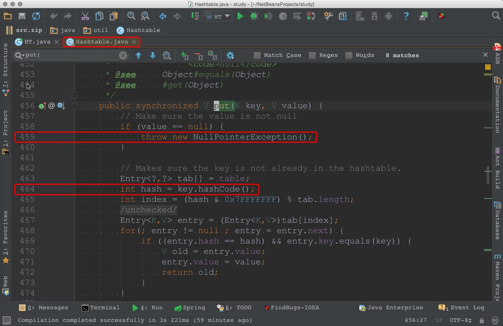
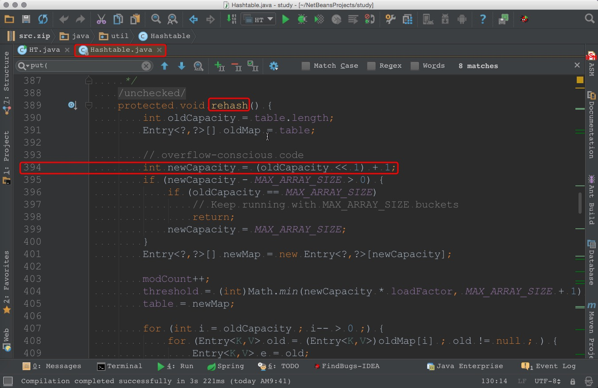

# 1. 参考资料
1. [https://hadyang.github.io/interview/docs/basic/algo/hash/](https://hadyang.github.io/interview/docs/basic/algo/hash/)
2. [https://hadyang.github.io/interview/docs/java/collection/HashMap/](https://hadyang.github.io/interview/docs/java/collection/HashMap/)
2. [https://docs.oracle.com/javase/8/docs/api/java/util/Hashtable.html](https://docs.oracle.com/javase/8/docs/api/java/util/Hashtable.html)


# 2. 简述
`java.util.HashMap`(下文简称为 `HashMap`) 和 `java.util.Hashtable`(下文简称为 `Hashtable`) 都实现了 `java.util.Map` 接口，
它们的源码有不少相通之处，将两者的源码结合起来看，会有新的收获。

`Hashtable` 的源文件有一千多行(虽然有很多行是注释，但是总的代码量还是挺大的)，如果每一行都细看，则要花费不少时间。本文只涉及如下三部分内容
1. `Hashtable` 中的重要字段
2. `Hashtable` 的创建以及增删查改的操作
3. `Hashtable` 与 `HashMap` 的区别

## 2.1 `Hashtable` 中的重要字段
本文只涉及如下5个字段
1. `table` 字段
2. `count` 字段
3. `threshold` 字段
4. `loadFactor` 字段
5. `modCount` 字段


### 2.1.1 `table` 字段

`table` 字段用于保存 `Hashtable` 中的桶， `table.length` 的值就是桶的数量

```java
/**
 * The hash table data.
 */
private transient Entry<?,?>[] table;
```

`table` 是 `Entry` 类型的数组，而 `Entry` 是 `Hashtable` 的静态内部类

```java
/**
 * Hashtable bucket collision list entry
 */
private static class Entry<K,V> implements Map.Entry<K,V> {
    // hash 值
    final int hash;
    // kv 对的 k
    final K key;
    // kv 对的 v
    V value;
    // 下一个元素
    Entry<K,V> next;
    // 构造函数和方法都略去了
}
```

`Entry` 实例连接在一起就可以构成单链表。


### 2.1.2 `count` 字段
`count` 字段用于保存 `Hashtable` 中 `Entry` 实例的数量(也就是 kv 对的数量)
```java
/**
 * The total number of entries in the hash table.
 */
private transient int count;
```

### 2.1.3 `threshold` 字段
`threshold` 字段用于保存阈值(判断是否需要扩容的逻辑与阈值有关)
```java
/**
 * The table is rehashed when its size exceeds this threshold.  (The
 * value of this field is (int)(capacity * loadFactor).)
 *
 * @serial
 */
private int threshold;
```

### 2.1.4 `loadFactor` 字段
`loadFactor` 字段用于保存负载因子，当 `Hashtable` 中的元素数量超过 `table.length * loadFactor` 时，就会触发扩容机制(扩容后，桶的数量会变多)。有的构造函数会将 `loadFactor` 的值设置成 `0.75f`(下文会看到)

```java
/**
 * The load factor for the hashtable.
 *
 * @serial
 */
private float loadFactor;
```

### 2.1.5 `modCount` 字段
`modCount` 字段用于保存 `Hashtable` 经历过的结构性变更的次数
```java
/**
 * The number of times this Hashtable has been structurally modified
 * Structural modifications are those that change the number of entries in
 * the Hashtable or otherwise modify its internal structure (e.g.,
 * rehash).  This field is used to make iterators on Collection-views of
 * the Hashtable fail-fast.  (See ConcurrentModificationException).
 */
private transient int modCount = 0;
```

## 2.2 `Hashtable` 的创建以及增删查改的操作
`Hashtable` 的 **创建** 是通过构造函数完成的，相关内容在 `2.2.1` 小节。   
`Hashtable` 的 **增** 和 **改** 是由 `put(...)` 方法完成的，相关内容在 `2.2.2` 小节。   
`Hashtable` 的 **查** 是通过 `get(...)` 方法完成的，相关内容在 `2.2.3` 小节。   
`Hashtable` 的 **删** 是通过 `remove(...)` 方法完成的，相关内容在 `2.2.4` 小节。   

### 2.2.1 `Hashtable` 的创建逻辑


`Hashtable` 的构造函数有4个，具体如下
1. 指定 `initialCapacity`(初始容量) 和 `loadFactor`(负载因子)

`initialCapacity` 这个参数用于指定初始的桶数(也就是 `table` 数组中的 `length`)，`loadFactor` 用于计算何时进行扩容
```java
public Hashtable(int initialCapacity, float loadFactor) {
    // initialCapacity 不能小于 0
    if (initialCapacity < 0)
        throw new IllegalArgumentException("Illegal Capacity: "+
                initialCapacity);
    // 不予许 loadFactor <=0 ，也不允许loadFactor 是 NaN
    if (loadFactor <= 0 || Float.isNaN(loadFactor))
        throw new IllegalArgumentException("Illegal Load: "+loadFactor);
    // 如果 initialCapacity 为 0， 则替换成 1
    if (initialCapacity==0)
        initialCapacity = 1;
    this.loadFactor = loadFactor;
    // table 中的元素个数(也就是桶的数量)刚好等于 initialCapacity
    table = new Entry<?,?>[initialCapacity];
    threshold = (int)Math.min(initialCapacity * loadFactor, MAX_ARRAY_SIZE + 1);
}
```

2. 指定 `initialCapacity`(初始容量) 

这个构造函数会调用第一个构造函数(它会将 `loadFactor` 参数的值指定成 `0.75f`)
```java
public Hashtable(int initialCapacity) {
    this(initialCapacity, 0.75f);
}
```

3. 无参构造函数

这个构造函数会调用第一个构造函数(它会将 `initialCapacity` 和 `loadFactor` 这两个参数的值分别指定成 `11` 和 `0.75f`)
```java
public Hashtable() {
    this(11, 0.75f);
}
```

4. 将一个 `Map` 作为参数

```java
public Hashtable(Map<? extends K, ? extends V> t) {
    // 调用第一个构造函数，并保证 initialCapacity 足够大(这样在 putAll(t) 的时候，不会触发扩容)
    this(Math.max(2*t.size(), 11), 0.75f);
    // 把 t 中的元素全都复制过来
    putAll(t);
}
```

### 2.2.2 `put(...)`
```java
/**
 * Maps the specified <code>key</code> to the specified
 * <code>value</code> in this hashtable. Neither the key nor the
 * value can be <code>null</code>. <p>
 *
 * The value can be retrieved by calling the <code>get</code> method
 * with a key that is equal to the original key.
 *
 * @param      key     the hashtable key
 * @param      value   the value
 * @return     the previous value of the specified key in this hashtable,
 *             or <code>null</code> if it did not have one
 * @exception  NullPointerException  if the key or value is
 *               <code>null</code>
 * @see     Object#equals(Object)
 * @see     #get(Object)
 */
public synchronized V put(K key, V value) {
    // Make sure the value is not null
    if (value == null) {
        throw new NullPointerException();
    }

    // Makes sure the key is not already in the hashtable.
    Entry<?,?> tab[] = table;
    int hash = key.hashCode();
    // 1. hash & 0x7FFFFFFF 的作用是保留 hash 的低 31 位(也就是将最高位清零)
    // 2. 将 (hash & 0x7FFFFFFF) % tab.length 的值保存在 index 中，那么 index 就是 key 对应的桶的下标
    int index = (hash & 0x7FFFFFFF) % tab.length;
    // Hashtable 中使用拉链法(不涉及红黑树)来解决冲突。tab[index] 对应的桶是一个单链表的头元素，遍历这个单链表，如果在遍历时找到了匹配的 entry，则直接替换其 value。
    @SuppressWarnings("unchecked")
    Entry<K,V> entry = (Entry<K,V>)tab[index];
    for(; entry != null ; entry = entry.next) {
        if ((entry.hash == hash) && entry.key.equals(key)) {
            V old = entry.value;
            entry.value = value;
            return old;
        }
    }

    // 如果 tab[index] 对应的单链表中没有与 key 匹配的元素，则使用头插法进行处理
    addEntry(hash, key, value, index);
    return null;
}

```

`addEntry(...)` 的核心逻辑是使用头插法将新元素放置在对应的单链表里
```java
private void addEntry(int hash, K key, V value, int index) {
    // Hashtable 将要发生一次结构性变化(新增一个 Entry)，所以计数值加一
    modCount++;

    Entry<?,?> tab[] = table;
    if (count >= threshold) {
        // Rehash the table if the threshold is exceeded
        rehash();

        tab = table;
        hash = key.hashCode();
        index = (hash & 0x7FFFFFFF) % tab.length;
    }

    // Creates the new entry.
    @SuppressWarnings("unchecked")
    Entry<K,V> e = (Entry<K,V>) tab[index];
    tab[index] = new Entry<>(hash, key, value, e);
    // Hashtable 中的 Entry 实例数加一
    count++;
}
```

在调用 `addEntry(...)` 方法时，有可能会触发扩容操作，扩容操作是通过 `rehash()` 实现的
```java
/**
 * Increases the capacity of and internally reorganizes this
 * hashtable, in order to accommodate and access its entries more
 * efficiently.  This method is called automatically when the
 * number of keys in the hashtable exceeds this hashtable's capacity
 * and load factor.
 */
@SuppressWarnings("unchecked")
protected void rehash() {
    int oldCapacity = table.length;
    Entry<?,?>[] oldMap = table;

    // overflow-conscious code
    // 新容量=老容量*2 + 1
    int newCapacity = (oldCapacity << 1) + 1;
    if (newCapacity - MAX_ARRAY_SIZE > 0) {
        if (oldCapacity == MAX_ARRAY_SIZE)
            // Keep running with MAX_ARRAY_SIZE buckets
            return;
        newCapacity = MAX_ARRAY_SIZE;
    }
    // 新 Map 的容量(即桶的数量)=newCapacity
    Entry<?,?>[] newMap = new Entry<?,?>[newCapacity];

    // Hashtable 将要发生一次结构性变化(桶中的 Entry 会重新组装一次)，所以计数值加一
    modCount++;
    // 计算新的阈值。除极端情况外，新的阈值=newCapacity * loadFactor
    threshold = (int)Math.min(newCapacity * loadFactor, MAX_ARRAY_SIZE + 1);
    // 让 table 指向 newMap
    table = newMap;

    // 外层循环的作用：对 oldMap 中的所有桶进行遍历处理
    for (int i = oldCapacity ; i-- > 0 ;) {
        // 内层循环的作用：对单链表中的元素进行遍历(每个桶都对应一个单链表的表头元素)
        for (Entry<K,V> old = (Entry<K,V>)oldMap[i] ; old != null ; ) {
            Entry<K,V> e = old;
            old = old.next;
            // 计算 e 应该放在 newMap 中的哪个桶
            int index = (e.hash & 0x7FFFFFFF) % newCapacity;
           // 用头插法将 e 放到 newMap 中
            e.next = (Entry<K,V>)newMap[index];
            newMap[index] = e;
        }
    }
}
```

### 2.2.3 `remove(...)`
删的逻辑比 增/改 的逻辑简单一点(因为不涉及扩容)，其核心步骤如下
1. 计算 key 对应的 hash 值
2. 计算 hash 值对应的桶的下标(将下标值记为 index)
3. 遍历 table[index] 对应的单链表，查找与 key 匹配的 `Entry`
4. 如果有与 key 匹配的元素，则将那个元素删除

完整的代码如下

```java
/**
 * Removes the key (and its corresponding value) from this
 * hashtable. This method does nothing if the key is not in the hashtable.
 *
 * @param   key   the key that needs to be removed
 * @return  the value to which the key had been mapped in this hashtable,
 *          or <code>null</code> if the key did not have a mapping
 * @throws  NullPointerException  if the key is <code>null</code>
 */
public synchronized V remove(Object key) {
    Entry<?,?> tab[] = table;
    // 获取 key 对应的 hash 值
    int hash = key.hashCode();
    // 1. hash & 0x7FFFFFFF 的作用是保留 hash 的低 31 位(也就是将最高位清零)
    // 2. 将 (hash & 0x7FFFFFFF) % tab.length 的值保存在 index 中，那么 index 就是 key 对应的桶的下标
    int index = (hash & 0x7FFFFFFF) % tab.length;
    @SuppressWarnings("unchecked")
    Entry<K,V> e = (Entry<K,V>)tab[index];
    // for 循环的作用：遍历 e 对应的单链表，查找与 key 对应的元素(tab 中的每个元素都是单链表的表头，所以 e 也是一个单链表的表头)
    for(Entry<K,V> prev = null ; e != null ; prev = e, e = e.next) {
        if ((e.hash == hash) && e.key.equals(key)) {
            // Hashtable 将要发生一次结构性变化(Entry 的数量会减一)，所以计数值加一
            modCount++;
            // 如果 if 分支成立，则说明找到与 key 匹配的元素了
            if (prev != null) {
                // 这个单链表中与 key 对应的元素不是链表的头
                prev.next = e.next;
            } else {
                // prev == null，说明这个单链表中与 key 对应的元素刚好是链表头 
                tab[index] = e.next;
            }
            // Hashtable 中的实例数减一
            count--;
            V oldValue = e.value;
            e.value = null;
            return oldValue;
        }
    }
    // 没有找到和 key 匹配的元素 
    return null;
}
```

### 2.2.4 `get(...)`
查询逻辑的核心步骤如下
1. 计算 key 对应的 hash 值
2. 计算 hash 值对应的桶的下标(将下标值记为 index)
3. 遍历 table[index] 对应的单链表，查找与 key 匹配的 `Entry`

```java
/**
 * Returns the value to which the specified key is mapped,
 * or {@code null} if this map contains no mapping for the key.
 *
 * <p>More formally, if this map contains a mapping from a key
 * {@code k} to a value {@code v} such that {@code (key.equals(k))},
 * then this method returns {@code v}; otherwise it returns
 * {@code null}.  (There can be at most one such mapping.)
 *
 * @param key the key whose associated value is to be returned
 * @return the value to which the specified key is mapped, or
 *         {@code null} if this map contains no mapping for the key
 * @throws NullPointerException if the specified key is null
 * @see     #put(Object, Object)
 */
@SuppressWarnings("unchecked")
public synchronized V get(Object key) {
    Entry<?,?> tab[] = table;
    // 获取 key 对应的 hash 值
    int hash = key.hashCode();
    // 1. hash & 0x7FFFFFFF 的作用是保留 hash 的低 31 位(也就是将最高位清零)
    // 2. 将 (hash & 0x7FFFFFFF) % tab.length 的值保存在 index 中，那么 index 就是 key 对应的桶的下标
    int index = (hash & 0x7FFFFFFF) % tab.length;
    // for 循环的作用：遍历 e 对应的单链表，查找与 key 对应的元素(tab 中的每个元素都是单链表的头元素，所以 e 也是一个单链表的头元素)
    for (Entry<?,?> e = tab[index] ; e != null ; e = e.next) {
        if ((e.hash == hash) && e.key.equals(key)) {
            return (V)e.value;
        }
    }
    // 没找到与 key 对应的元素
    return null;
}
```


# `Hashtable` 与 `HashMap` 的区别
1. 对 `null` 的支持   


`Hashtable` 中 `key` 和 `value` 都不允许为 `null`(如果 `key` 为空，会在上图所示的 464 行抛空指针异常，如果 `value` 为空，会在 上图所示的 459 行抛空指针异常)，
`HashMap` 中 `key` 和 `value` 都可以为 `null`。


2. 扩容   
`HashMap` 中桶的数量始终是 2 的幂次，
`Hashtable` 中桶的数量不需要是 2 的幂次。
因为 `HashMap` 中桶的数量始终是 2 的幂次，所以 `HashMap` 在计算 kv 对所对应的桶下标时，就可以利用位运算来做到，而 `Hashtable` 中则是通过 `%` 来进行取余。`HashMap` 扩容时，`新的桶数=旧的桶数*2`，而 `Hashtable` 扩容时，`新的桶数=旧的桶数*2+1`(计算逻辑可以参考下图所示的 394 行)

如果使用 `Hashtable` 的无参构造函数，则 `Hashtable` 的初始桶数会是 `11`，第一次扩容后变为 `11*2+1=23`，第二次扩容后变为 `23*2+1=47`。令 `a[0]=11`, `a[i]` 表示第i次扩容后的桶数，则 `a[n+1] = 2*a[n] + 1`，所以 `a[n+1] + 1 = 2 * (a[n] + 1)`, 所以 `a[n] = (3*2^(n+2))-1`

3. 对 hash 碰撞的处理    
`Hashtable` 中仅使用拉链法来处理碰撞(归属于于同一个桶的所有 `Entry` 会形成一个单链表)，而 `HashMap` 则会在一定情况下将链表转化为红黑树。所以当 hash 冲突很多时，`Hashtable` 的性能就会明显下降。
